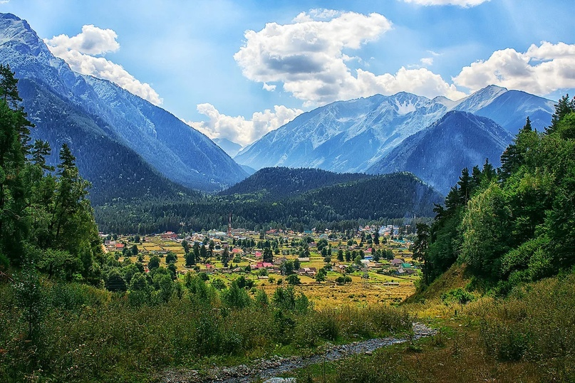
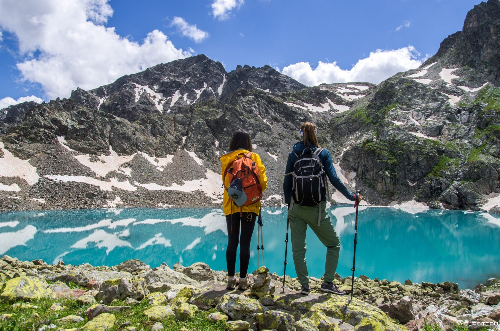

Архыз
######################

:Slug: arhyz23
:Date: 2023-07-01 19:19
:Summary: Середина лета - самое время овощам выбраться поближе к солнцу!
:Status: draft

Тут вам никаких лыж!

Архыз - небольшой поселок, окруженный горами, находится на высоте почти 1500 м над уровнем моря. Здесь сочетается колорит Карачаевско-Черкесской республики и уникальная природа среднегорья!

В программе сбора: кросс-походы на озеро Любви, гору Чигордали, Баритовый и Софийский водопады, озеро Семицветное и многое другое...

Основной упор делаем на культурной части: походы в самые красивые места помогут проникнуться лучше к природе Кавказских гор!

Кроме походов в программе силовые и беговые трени- ровки, работа над техникой бега и обучение работе с палками при беге/ходьбе в гору.

`Подробное описание <../images/arhyz/arhyz.pdf>`_

