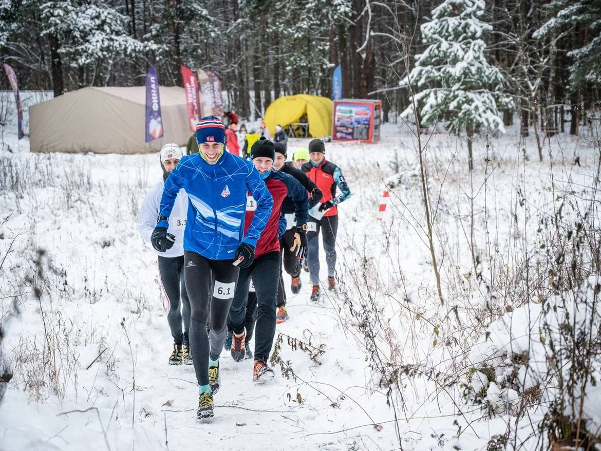
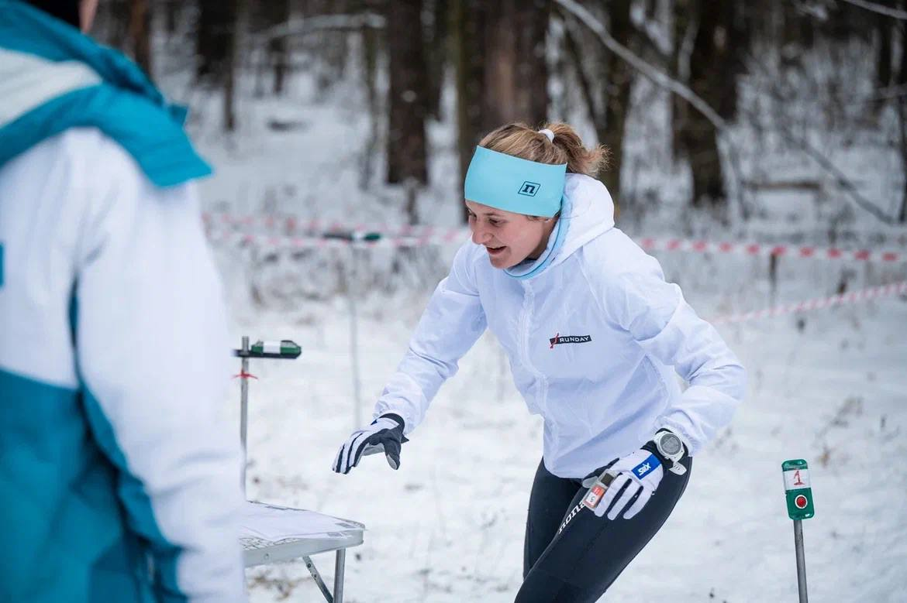
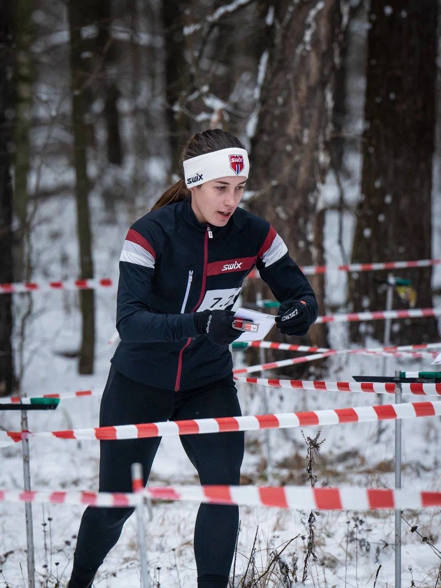
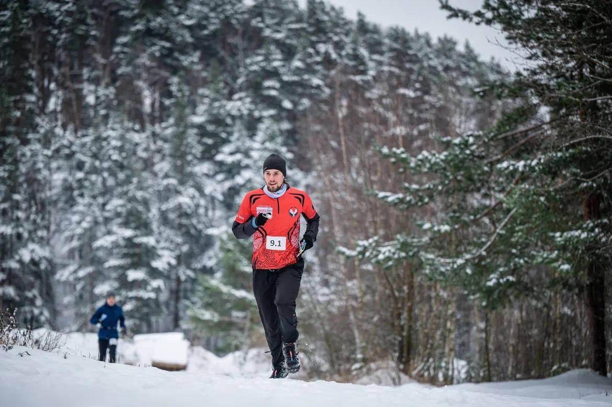

Закрытие бегового сезона
#########################

:Slug: end_run_season_2023
:Date: 2023-10-16 19:19
:Author: sornyak
:Summary: Закрытие бегового сезона
:category: Соревнования
:status: draft

Рано или поздно нам надо будет это сделать…

Закрыть беговой сезон🤩

Приглашаем всех на беговую эстафету - Закрытие Бегового сезона 2023✌️

✅18 ноября, ст.Труд, Ивантеевка, Московская область, старт в 11.00

✅2 человека, 6 этапов по 1.9 км

✅Динамичный и интересный, ну и конечно  очень веселый формат соревнований: ведь перед тем, как передать эстафету надо пройти через лабиринт 😁

✅Форматы: ЖЖ, МЖ, ММ, МЖЮ и родители-дети

А вообще это старт в честь Дня рождения главного судьи и организатора соревнований, Пашуто Анастасии, поэтому вы автоматически приглашены на этот утренник 😃

`Регистрация уже открыта  <https://orgeo.ru/event/registration/zbs_23>`_, количество мест ограничено 🤝

