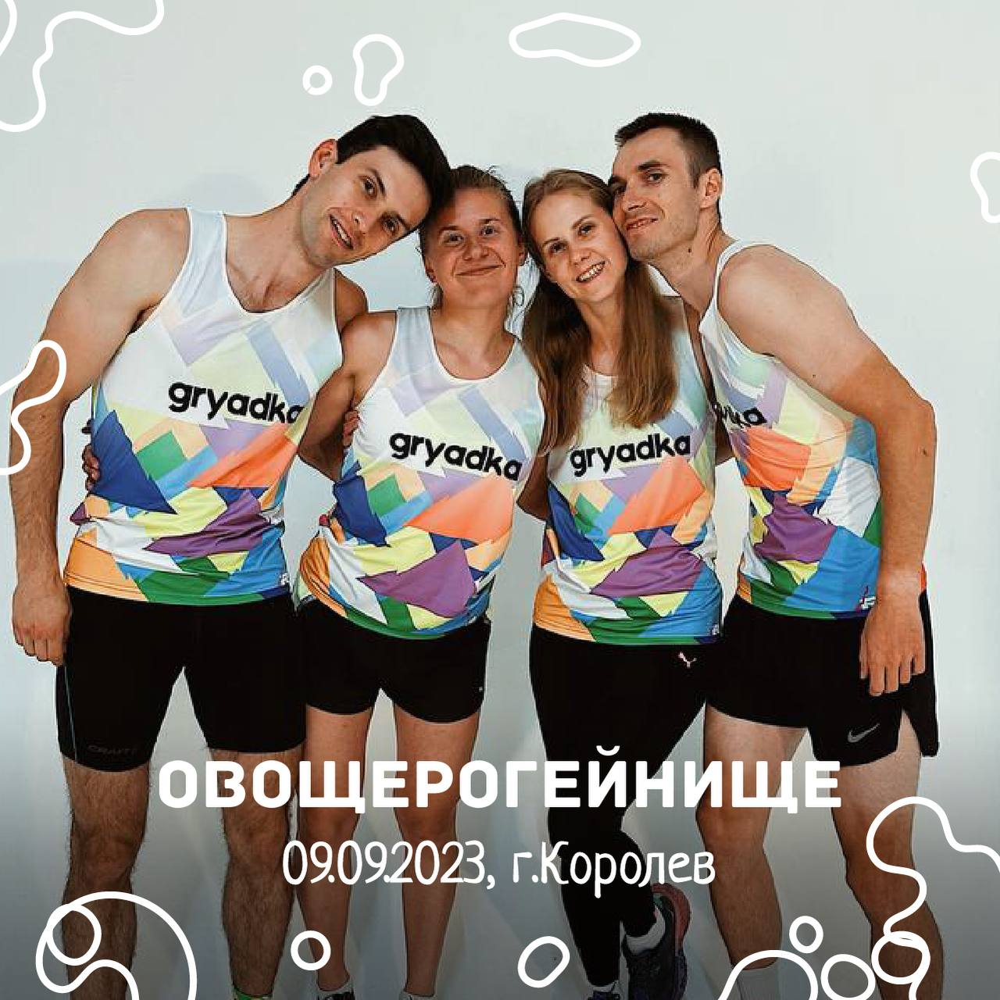

Овощерогейнище
###############

:Slug: rogein
:Date: 2023-09-09 19:19
:Author: sornyak
:Summary: Овощерогейнище 9 сентября, Королёв
:category: Соревнования
:status: draft

✅9 сентября состоится первый старт нашей овощной команды - Овощерогейнище!

❗️Что это за старт? Классический рогейн по всем правилам вида спорта с электронной отметкой и интересной дистанцией!

❔Что такое рогейн? Рогейн - это вид спорта, где задача спортсмена собрать как можно больше баллов. А баллы - это очки, которые мы получаем за посещение контрольных пунктов. Вы ограничены только временем, маршрут и КП выбираете сами 😎

✅Место старта - Вэйк-парк Гагарин, г. Королев, 1.5 км от жд станции Болшево

✅Короткие форматы - 3 часа на велосипеде и 4 часа бегом + формат 2 часа родители-дети

✅Отличные призы от партнеров и спонсоров, полезные подарки всем участникам!

💪Все участники и их группа поддержки получает скидку 10% на все услуги школы по кодовому слову - рогейн

|location_link|.

.. |location_link| raw:: html

    Регистрация открыта по <a href="https://orgeo.ru/event/ovosherogainishe" target="_blank">ссылке</a>

Подробное описание в `положении  <../images/rogein/Овощерогейнище.pdf>`_

🗺Публикуем техническую информацию.
Карта в масштабе в 1см - 150 метров формата А3, легенда - половина листа А4. На местности установлено 59 КП с номерами 31-89. В карте имеются непреодолимые водные преграды, закрытые и открытые кварталы, что в сочетании с несложным ориентированием и таким большим числом КП, нумерацией КП и самого длинного формата 4 часа бегом делают этот рогейн идеальной битвой стратегий, для чего и задумывался изначально сам рогейн!

На таком Овощерогейнище 9 сентября в субботу нельзя потеряться, но можно растеряться, нельзя остановиться и нужно торопиться! Бонусом красивые фоточки, роскошное место старта и вкусное питание после финиша!

`Пустая карта для ознакомления  <../images/rogein/Карта Королева_пустая.pdf>`_

