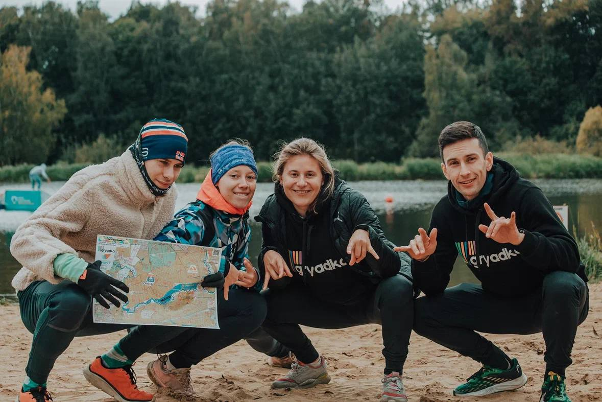
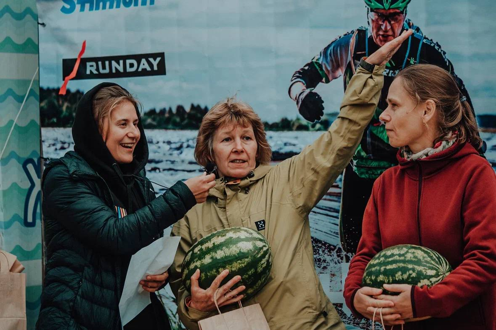
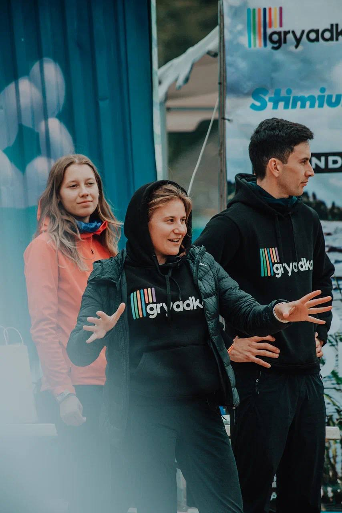
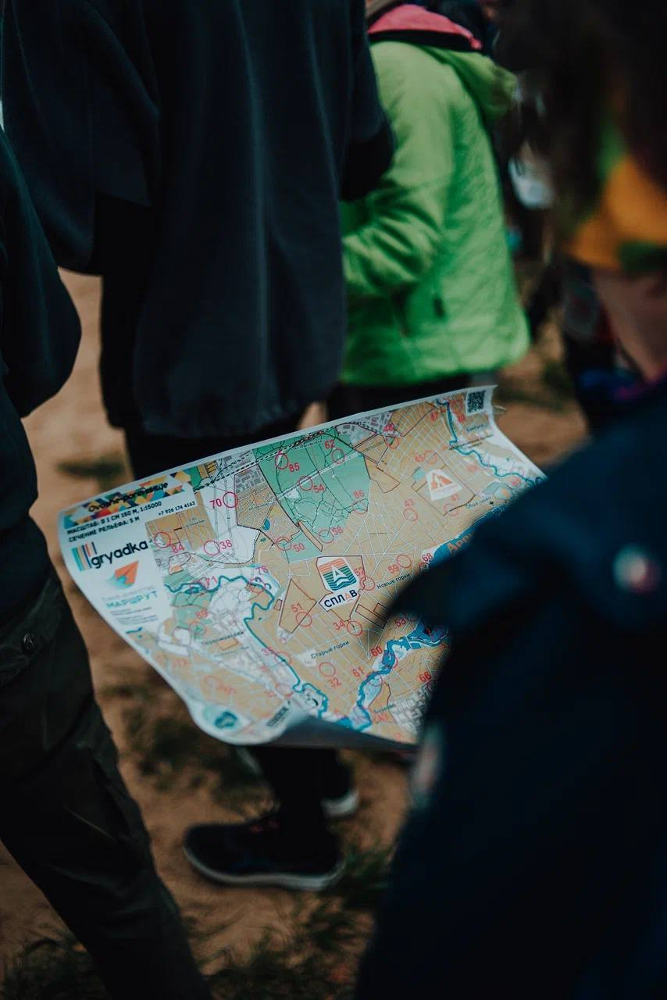
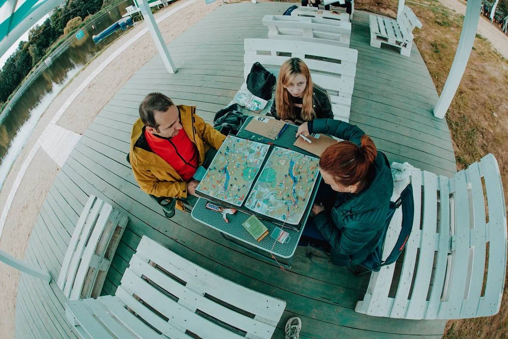
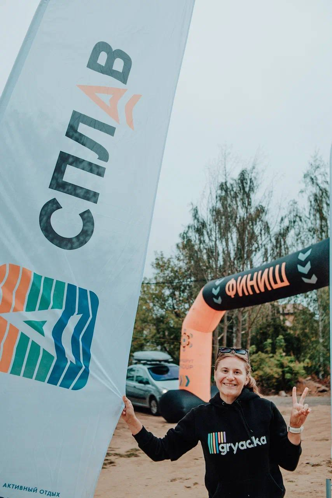

Овощерогейнище: как это было
#############################

:Slug: rogein_finish
:Date: 2023-09-16 19:19
:Author: sornyak
:Summary: Овощерогейнище 9 сентября, Королёв
:category: Соревнования

9 сентября состоялся наш долгожданный Овощерогейнище

🔰Старт и размещение участников было на территории школы водных видов спорта Гагарин (https://gagarin-waterschool.ru/) (кстати, рогейнеров ждут там до конца сезона и готовы дать скидку в 20% по кодовому слову "Овощерогейнище")

🔰Участникам и организаторам повезло с погодой: не было дождя, а значит - старт удался 😃

🔰Планировка дистанции стала весьма сложной задачей для спортсменов: ведь на местности стояло 59 КП, которые давали 369 баллов... Собрал ли кто-то все КП?... Мммм... нет😁 Максимум показал победитель формата 3 часа на велосипеде Николай Козлов - 268 баллов, но как видите - задача собрать все КП была не из простых!

🔰На финише всех участников ждали приятные сувениры всем финишерам, финишное питание и награждение подарками от наших партнеров!

Хочется отметить активность группы Родители-дети, на нашей памяти это рекорд в рогейнах, когда мы получили 44 человека  в этой группе по заявке😱

Приятно, что все команды, и особенно новички в рогейне отозвались положительно по итогам нашего соревнования, а опытные спортсмены весьма высоко оценили сложность дистанции (в части выбора вариантов).

Всего на старт вышло 124 человека (и все вернулись, конечно же). И для нашего первого старта это отличный результат и мы не будем останавливаться на достигнутом😎

Хотим выразить благодарность нашим участникам, команде организаторов GRYADKA и группы Маршрут, а также всем нашим партнерам:

💥 `Вэйк-парк Гагарин  <https://gagarin-waterschool.ru/>`_ (лучшие инструктора и полный комплекс водных развлечений): до конца сезона скидка всем участникам рогейна по кодовому слову "Овощерогейнище"

💥Детское питание `Бабушкино лукошко <https://babluk.ru/>`_  (лучший спортпит и хорошая замена гелей на длинных спокойных тренировках и гонках)

💥Спортивная одежда `Сплав <https://www.splav.ru/>`_  от тактики до кэжуал, а скоро появится и коллекция для бега!

💥 `Арена <https://arenasportfood.ru/>`_ спортивное питание на каждый случай жизни, от гелей до спортивных батончиков и БАДов

💥 `Stimium <https://stimium.store/>`_  французский бренд спортивного питания и БАДов с доказанной эффективностью и рабочими дозировками (промокод на  скидку на сайте - GRYADKA)

💥 `RUNDAY <https://www.ozon.ru/seller/runday-713780/products/?miniapp=seller_713780>`_ спортивная одежда, чтобы быть ярким в любую погоду, молодой российский бренд, уверенно залетающий в ваши шкафы 😃

💥Кофейня `Совенок <https://yandex.ru/maps/org/kafe_sovenok/192176140394/?ll=37.867870%2C55.939454&z=15>`_ вкусный кофе и ароматная выпечка, но только для жителей Королева (и конечно же, гостей города)😃

✅Фотографии с Овощерогейнища https://disk.yandex.ru/d/Wh7ftebxD0FmMg

🤝Спасибо фотографу Anya Trempoltseva

✅Выкладываем пути участников https://forestadventure.ru/2023/ov/

🤝Спасибо Семену Якимову за визуализацию

✅Результаты и сплиты http://files.mosplay.ru/protokol/2023/0909_Ovosherogaine.html

`Финальная карта <../images/rogein/kr2022.pdf>`_

.. image:: ../images/rogein/photo_2023-09-12_22-54-50.jpg

