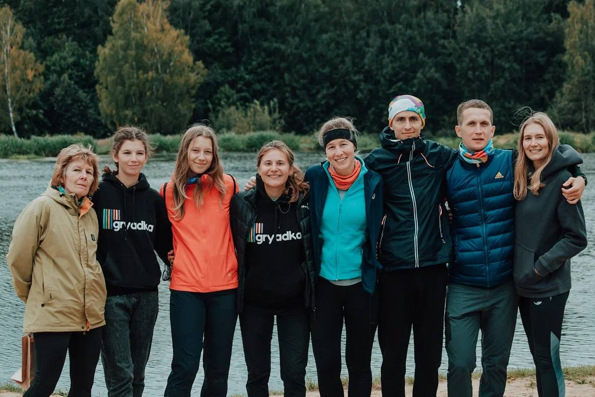
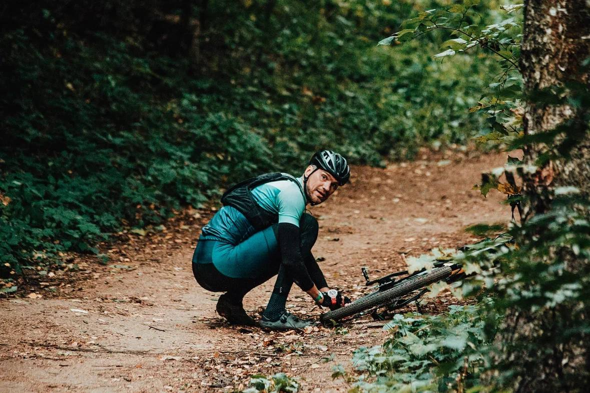
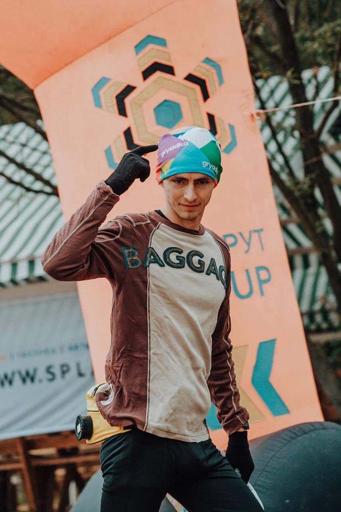
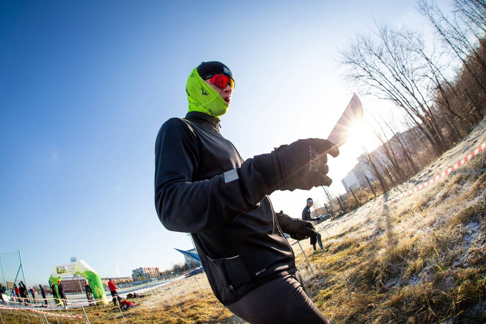

Что вас ждет в 2024 году?
##########################

:Slug: season_2024
:Date: 2023-12-22 19:19
:Author: sornyak
:Summary: Открытие регистрации…🥳
:category: Соревнования

Открытие регистрации…🥳

Было еще вчера, но мы не хотели отвлекать вас от пятничного веселья

Что вас ждет? Мы не храним молчание 😎

☑️25.05.2024: Рогейн Альпийская горка, Яхрома, регистрация закрыта, держим интригу дальше 😎

.. image:: ../images/season2024/5.jpg

✅13.07.2024: Подкуст-рогейн, поселок имени Цюрупы, Воскресенский район

⚡️2 и 5 часов бегом, 4 часа вело, 2 часа родители-дети

⚡️Карта в знаках спортивного ориентирования

⚡️Старт с лыжной базы Наседкиных

⚡️Один из самых красивых лесов Подмосковья (да еще и речка рядом - сказка, а не район соревнований)

⚡️ https://orgeo.ru/event/podkust

✅21.09.2024: Овощерогейнище2.0, Королев, Московская область

⚡️2 часа РД, 3 часа вело, 4 часа бегом

⚡️ЮЗ часть Королева с захватом Лосиного острова

⚡️Тихие районы частной застройки + огромный лесной массив Лосиного острова

⚡️Место старта в процессе согласования

⚡️ https://orgeo.ru/event/ovosherogainishe2_0

✅16.11.2024: ЗБС-эстафета, МО, место старта сообщим позже

⚡️ 2 человека, 6 этапов по ~2 км + лабиринт

⚡️ Ставший ежегодным старт, будет проводиться 3 раз

⚡️ Празднуем закрытие бегового сезона и ДР главного организатора, судьи и дизайнера Грядки😁

⚡️ https://orgeo.ru/event/zbs2024

Почему говорим о регистрации уже сейчас?

❗️Ранняя регистрация до 31.12 доступна по самой низкой цене, сделайте правильный выбор в пользу самого овощного клуба 😃

